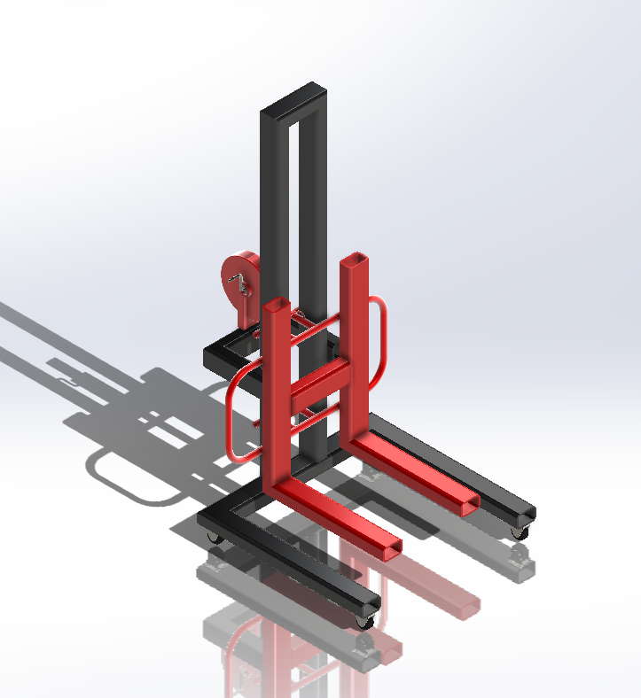
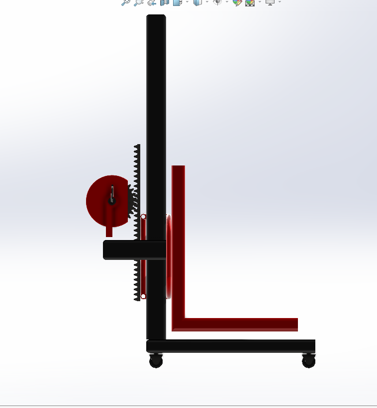
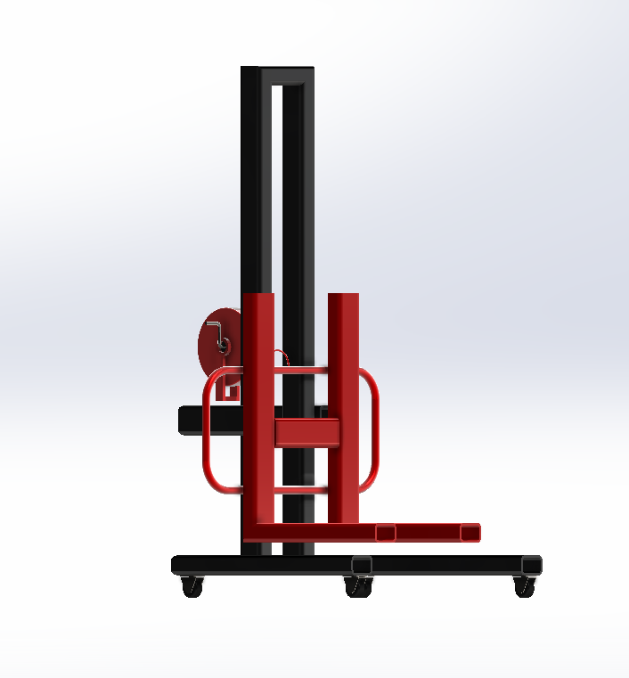
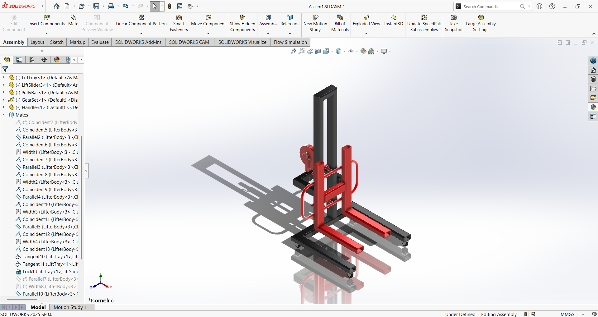
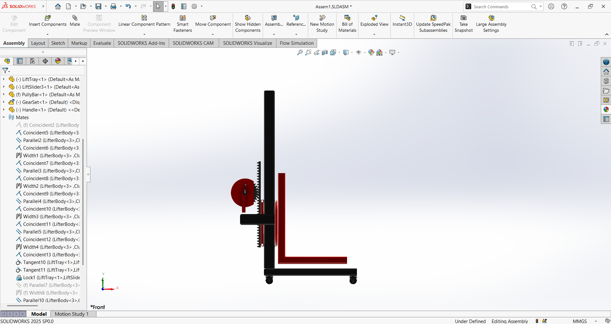
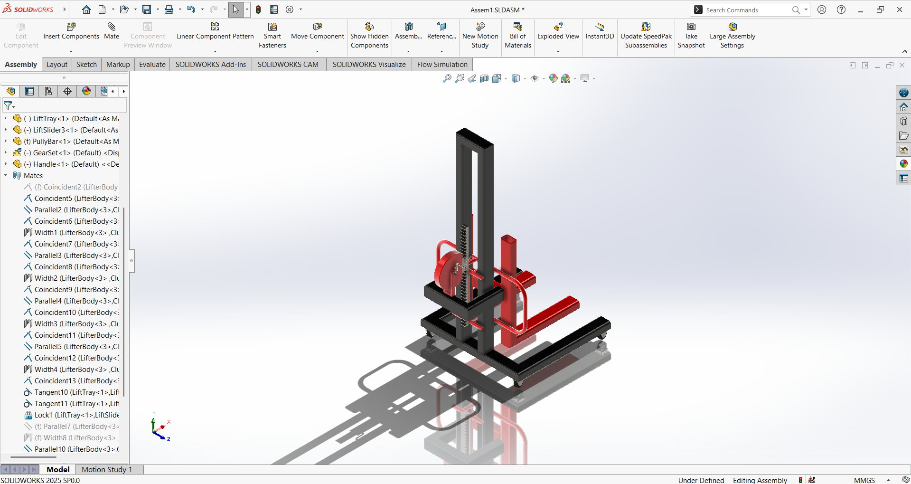

# 🛠️ Hand-Operated Mini Forklift for Laboratory Use

<div align="center">



**A compact and practical hand-operated forklift designed for safe and efficient material handling in tight spaces**

[](https://www.solidworks.com/)
[](https://github.com/TMNPThennakoon/Hand-Operated-Mini-Forklift-for-Laboratory-Use)
[](LICENSE)

</div>

---

## 📋 Table of Contents

- [Overview](#-overview)
- [Why This Project?](#-why-this-project-was-important)
- [Project Purpose](#-project-purpose)
- [Core Objectives](#-core-objectives)
- [Project Scope](#-project-scope)
- [Design Features](#-design-features)
- [Project Gallery](#-project-gallery)
- [Technical Details](#-technical-details)
- [File Structure](#-file-structure)
- [Skills Developed](#-skills-developed)
- [Technologies Used](#-technologies-used)

---

## 🎯 Overview

This project presents a **Hand-Operated Mini Forklift** designed and modeled using SolidWorks as part of a university welding and fabrication course. The design focuses on creating a compact, safe, and efficient solution for material handling in laboratory, workshop, and small storage environments.



---

## 🧱 Why This Project Was Important

Manual lifting in workshops, small storage areas, and home environments can cause:
- **Physical strain and injuries** to workers
- **Loss of efficiency** in material handling operations
- **Increased labor requirements** (multiple people needed for heavy loads)
- **Higher risk of accidents** during manual handling

This project addresses these challenges by providing a **safer and more efficient manual handling solution** that reduces physical effort and improves workplace safety.

---

## 💡 Project Purpose

To develop a **compact and practical hand-operated forklift** that:
- ✅ Improves safety in material handling operations
- ✅ Reduces physical effort required for lifting
- ✅ Supports smooth movement of materials in tight spaces
- ✅ Demonstrates engineering design principles and fabrication skills



---

## 🎯 Core Objectives

The project was designed to achieve the following objectives:

- ✅ **Create a strong and stable structure** - Ensuring structural integrity and load-bearing capacity
- ✅ **Achieve target lifting height and load capacity** - Meeting functional requirements for laboratory use
- ✅ **Use available materials effectively** - Optimizing material selection and usage
- ✅ **Ensure good finishing and corrosion resistance** - Applying proper surface treatments
- ✅ **Apply CAD modeling, design principles, and fabrication skills** - Integrating theoretical knowledge with practical application


---

## 🛠️ Project Scope

The project work included:

1. **Concept Development** - Initial design ideation and requirement analysis
2. **CAD Modeling** - Complete 3D modeling using SolidWorks
3. **Engineering Drawings** - Technical drawings for manufacturing
4. **BOM Preparation** - Bill of Materials for cost estimation
5. **Cost Estimation** - Material and manufacturing cost analysis
6. **Fabrication Steps** - Manufacturing process planning
7. **Finishing** - Surface treatment and corrosion protection

The goal was to produce a **functional prototype** that demonstrates engineering concepts using available resources and time.



---

## 🎨 Design Features

### Key Components

- **Base Frame**: Rectangular frame with parallel beams for load support
- **Vertical Mast**: U-shaped mast providing vertical guidance for lifting mechanism
- **Fork Assembly**: Movable fork system with horizontal load-bearing forks
- **Hand-Operated Winch**: Manual lifting mechanism for raising and lowering loads
- **Mobility System**: Wheel assembly for easy movement in tight spaces
- **Handle**: Ergonomic handle for pushing and pulling the forklift

### Design Highlights

- **Compact Design**: Optimized for use in confined spaces
- **Two-Tone Color Scheme**: Black frame with red movable components for visual distinction
- **Ergonomic Operation**: Hand-operated winch for safe and controlled lifting
- **Stable Structure**: Robust frame design ensuring stability under load



---

## 📸 Project Gallery

<div align="center">

### Isometric View


### Side View


### Front View


### Top View


### Detail View


### Assembly View


### Final Render


</div>

---

## 🔧 Technical Details

### Software
- **SolidWorks** - 3D CAD modeling and assembly
- **Engineering Drawings** - Technical documentation

### File Types
- `.SLDPRT` - SolidWorks Part files
- `.SLDASM` - SolidWorks Assembly files
- `.SLDDRW` - SolidWorks Drawing files

### Design Methodology
- Parametric modeling approach
- Assembly constraints and relationships
- Engineering drawing standards
- Material selection and optimization

---

## 📁 File Structure

```
Forklift/
│
├── README.md                          # Project documentation
├── images/                            # Project images and renders
│   ├── 01-isometric-view.png
│   ├── 02-side-view.png
│   ├── 03-front-view.png
│   ├── 04-top-view.png
│   ├── 05-detail-view.png
│   ├── 06-assembly-view.png
│   └── 07-final-render.png
│
└── Lift_Final/                        # SolidWorks project files
    ├── LiftFinalAsem.SLDASM          # Main assembly
    ├── LiftFinalAsemDrawing.SLDDRW   # Engineering drawing
    ├── LifterBody.SLDPRT             # Main body component
    ├── LiftTray.SLDPRT               # Fork tray component
    ├── LiftSlider3.SLDPRT            # Slider mechanism
    ├── Pully.SLDASM                  # Pulley assembly
    ├── PullyHandle.SLDPRT            # Handle component
    ├── PullyWheel.SLDPRT             # Pulley wheel
    ├── ClusterWheel.SLDASM           # Wheel cluster assembly
    └── ...                           # Additional components
```

---

## 🎓 Skills Developed

This project strengthened:

- ✅ **Design Thinking** - Problem-solving through engineering design
- ✅ **Real-World Problem Solving** - Addressing practical material handling challenges
- ✅ **Hands-On Manufacturing Experience** - Understanding fabrication processes
- ✅ **CAD Modeling Proficiency** - Advanced SolidWorks skills
- ✅ **Engineering Drawing** - Technical documentation skills
- ✅ **Material Selection** - Choosing appropriate materials for application
- ✅ **Cost Estimation** - Project planning and budgeting

---

## 🛠️ Technologies Used

<div align="center">

| Technology | Purpose |
|------------|---------|
| **SolidWorks** | 3D CAD Modeling & Assembly |
| **Engineering Drawing Standards** | Technical Documentation |
| **Material Science** | Component Selection |
| **Manufacturing Processes** | Fabrication Planning |

</div>

---

## 🏷️ Tags

`#SolidWorks` `#EngineeringDesign` `#MechanicalEngineering` `#Manufacturing` `#Fabrication` `#WeldingProject` `#ProductDesign` `#CADModeling` `#Innovation` `#EngineeringStudents` `#MiniForklift` `#MaterialHandling` `#ProjectWork` `#EngineeringLife`

---

## 📝 Notes

This project was completed as part of a university welding and fabrication course, demonstrating the integration of:
- CAD modeling skills
- Engineering design principles
- Manufacturing process understanding
- Practical problem-solving abilities

---

## 👤 Author

**TMNP Thennakoon**

- GitHub: [@TMNPThennakoon](https://github.com/TMNPThennakoon)
- Project Repository: [Hand-Operated-Mini-Forklift-for-Laboratory-Use](https://github.com/TMNPThennakoon/Hand-Operated-Mini-Forklift-for-Laboratory-Use)

---

## 📄 License

This project is open source and available under the [MIT License](LICENSE).

---

<div align="center">

**⭐ If you find this project interesting, please consider giving it a star! ⭐**

Made with ❤️ for Engineering Education

</div>

